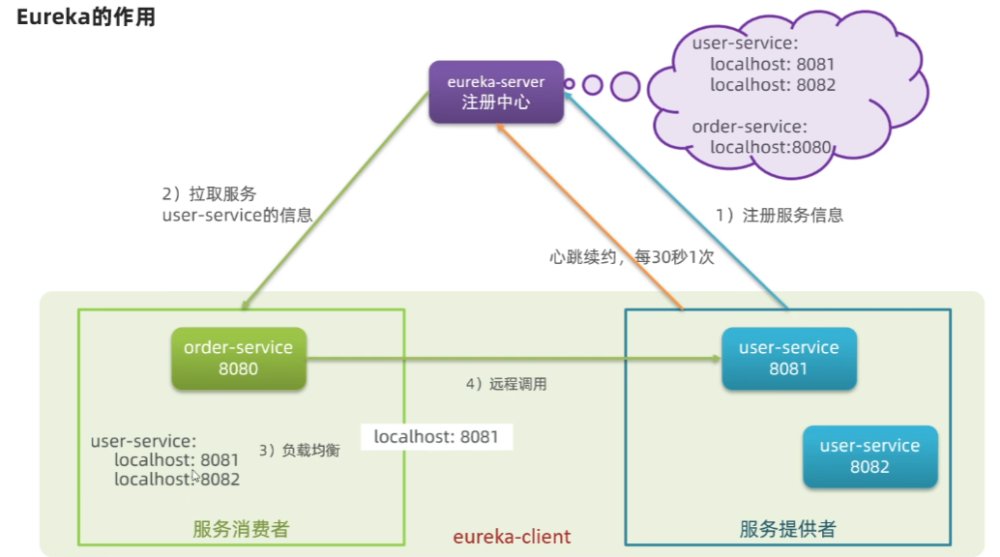
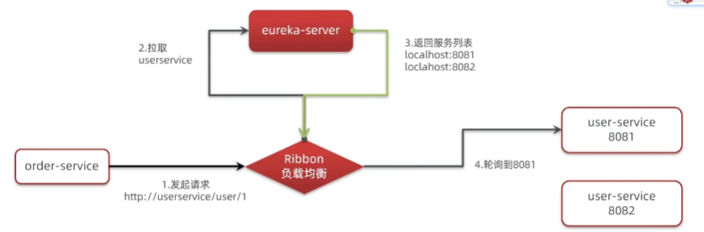

# 一、SpringCloud：


## ①远程调用请求：

- RestTemplate：

- 1、需要配置类 RestTemplateConfig

```java
@Configuration
public class RestTemplateConfig {

    @ConditionalOnMissingBean(org.springframework.web.client.RestTemplate.class)  // 表名该唯一
    @Bean
    public RestTemplate restTemplate(){
        return new RestTemplate();
    }
}

```

- 2、进行模拟

```java
@RestController
@Slf4j
public class TestController {

    @Autowired
    private RestTemplate restTemplate;

    @GetMapping("/test")
    private void getData(){
        String url = "xxx";
        JSONObject postData = new JSONObject();
        postData.put("room_id", "257");
        postData.put("site_id", "00001005020000000187");
        postData.put("report_time2", "2022-07-27 03:00:00");
        postData.put("report_time1", "2022-07-27 03:00:00");
        String result = restTemplate.postForEntity(url, postData, String.class).getBody();
        log.info(result);
    }
}
```

## ②服务调用关系：

- 服务提供者：暴露接口给其他微服务调用
- 服务消费者：调用其他微服务提供的接口
- 提供者与消费者角色是相对的
- 一个服务可以同时是服务提供者和服务消费者

# 二、Eureka注册中心：

## ①Eureka作用：

- EurekaServer：服务端，注册中心
  - 记录服务信息
  - 心跳监控
- EurekaClient： 客户端
  - Provider：服务提供者
    - 注册自己的信息到EurekaServer
    - 每隔30秒向 EurekaServer 发送心跳
  - Consumer：服务消费者：
    - 根据服务名称从 EurekaServer 拉取服务列表
    - 基于服务列表做负载均衡，选中一个微服务后发起远程调用



- 消费者获取信息时：
  - 服务提供者启动时会向eureka 注册自己的信息
  - eureka 保存这些信息
  - 消费者根据服务名称向eureka 拉去提供者信息
- 有多个服务提供者时：
  - 服务消费者利用负载均衡算法，从服务列表中挑选一个
- 消费者感知服务提供者健康：
  - 服务提供者会每隔30秒向EurekaServer发送心跳请求，报告健康状态
  - euraka 会更新记录服务列表信息，心跳不正常会被剔除
  - 消费者就可以拉取到最新的信息

# 三、Eureka 启动：

## 1、搭建：

①、引入依赖

```java
<!-- https://mvnrepository.com/artifact/org.springframework.cloud/spring-cloud-starter-netflix-eureka-server -->
        <dependency>
            <groupId>org.springframework.cloud</groupId>
            <artifactId>spring-cloud-starter-netflix-eureka-server</artifactId>
            <version>3.1.4</version>
        </dependency>
```

②、添加配置注解（在主启动类上加上@EnableEurekaServer注解）

```java
@EnableEurekaServer
@SpringBootApplication
public class EurekaServerApplication {
    public static void main(String[] args) {
        SpringApplication.run(EurekaServerApplication.class, args);
    }
}
```

③、添加配置文件 application.yml

```yaml
server:
  port: 10086

spring:
  application:
    name: eurekaserver   # eureka 服务名称
eureka:
  client:
    service-url:    # eureka 地址信息
      defaultZone: http://127.0.0.1:10086/eureka
    fetch-registry: false
```

## 2、注册：

①、添加环境依赖

```xml
<!-- https://mvnrepository.com/artifact/org.springframework.cloud/spring-cloud-starter-netflix-eureka-client -->
        <dependency>
            <groupId>org.springframework.cloud</groupId>
            <artifactId>spring-cloud-starter-netflix-eureka-client</artifactId>
            <version>3.1.4</version>
        </dependency>
```

②、添加配置文件

```yaml
spring:
  application:
    name: userservice   # eureka 服务名称
eureka:
  client:
    service-url:    # eureka 地址信息
      defaultZone: http://127.0.0.1:10086/eureka
```

## 3、服务拉取：

- 服务拉取是基于服务名称获取服务列表，然后对服务列表做负载均衡

①、修改相应代码，修改访问的url路径，用于服务名代替ip 、端口

```java
@Service
public class OrderService {

    @Autowired
    private OrderMapper orderMapper;

    @Autowired
    private RestTemplate restTemplate;


    public Order queryOrderById(Long orderId) {
        // 1.查询订单
        Order order = orderMapper.findById(orderId);
        // 4.返回

        //进行调用
        String url = "userservice/user/" + order.getUserId();
        User user = restTemplate.getForObject(url, User.class);
        order.setUser(user);
        return order;
    }
}
```

②、在相应代码项目中 RestTemplate 上添加 负载均衡 注解 （@LoadBalanced）：

```java
@Configuration
public class RestTemplateConfig {

    @ConditionalOnMissingBean(org.springframework.web.client.RestTemplate.class)  // 表名该唯一
    @Bean
    @LoadBalanced
    public RestTemplate restTemplate(){
        return new RestTemplate();
    }
}
```

# 四、Ribbon负载均衡：

## ①、负载均衡流程：


