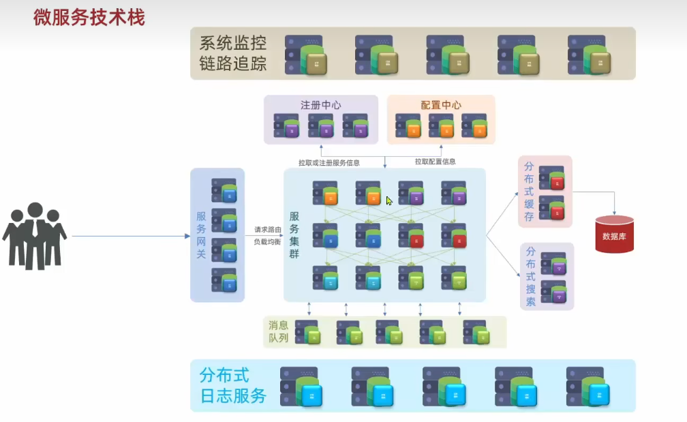
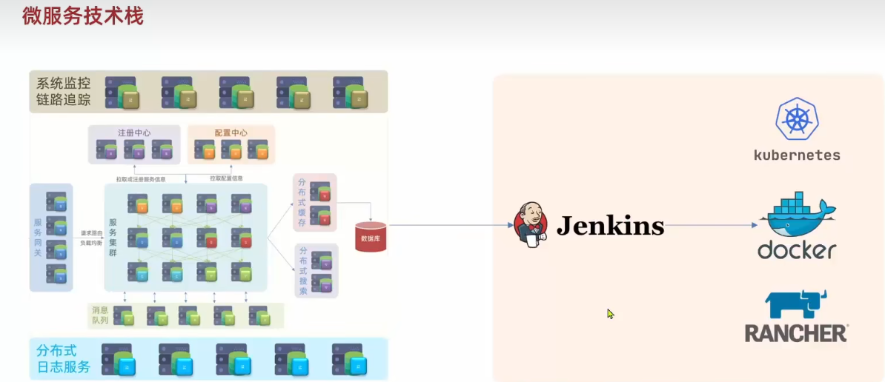
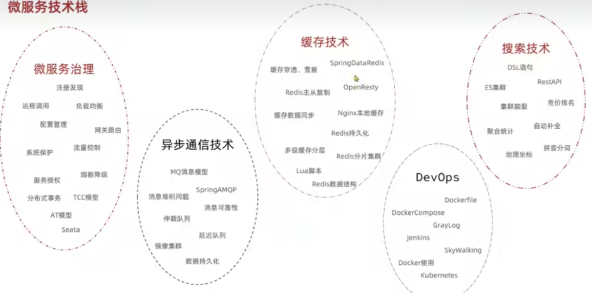
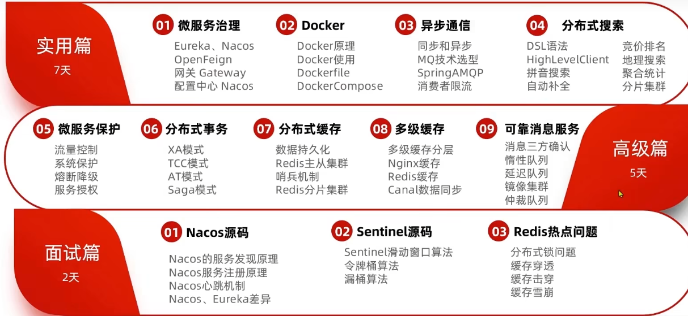
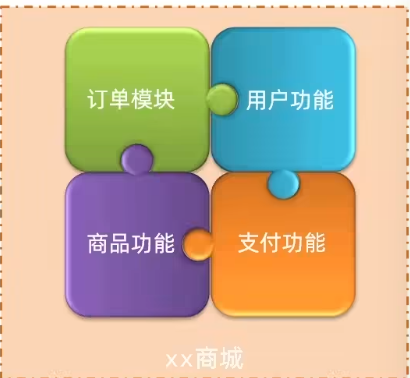
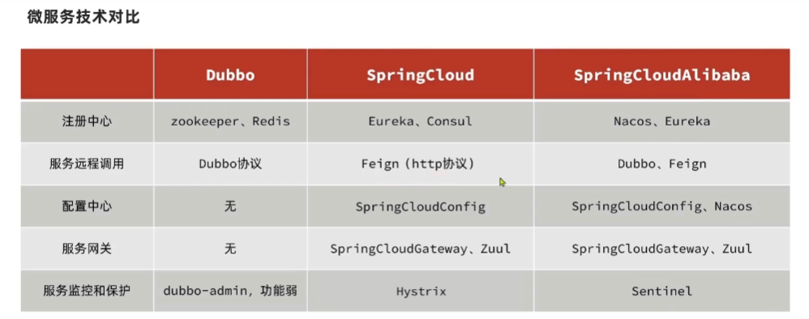
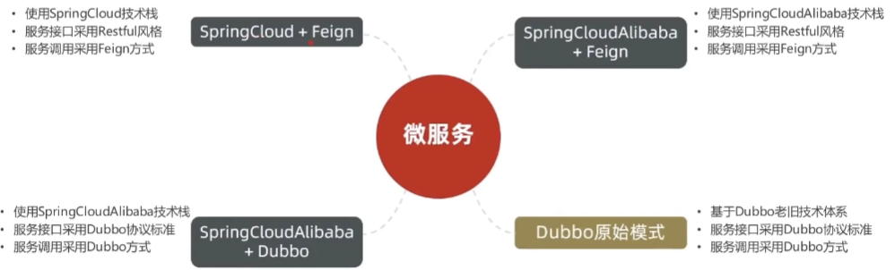
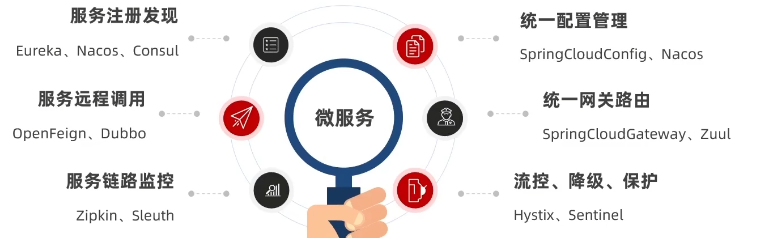

# 一、SpringCloud：















## ①远程调用请求：

- RestTemplate：

- 1、需要配置类 RestTemplateConfig

```java
@Configuration
public class RestTemplateConfig {

    @ConditionalOnMissingBean(org.springframework.web.client.RestTemplate.class)  // 表名该唯一
    @Bean
    public RestTemplate restTemplate(){
        return new RestTemplate();
    }
}

```

- 2、进行模拟

```java
@RestController
@Slf4j
public class TestController {

    @Autowired
    private RestTemplate restTemplate;

    @GetMapping("/test")
    private void getData(){
        String url = "xxx";
        JSONObject postData = new JSONObject();
        postData.put("room_id", "257");
        postData.put("site_id", "00001005020000000187");
        postData.put("report_time2", "2022-07-27 03:00:00");
        postData.put("report_time1", "2022-07-27 03:00:00");
        String result = restTemplate.postForEntity(url, postData, String.class).getBody();
        log.info(result);
    }
}
```

## ②服务调用关系：

- 服务提供者：暴露接口给其他微服务调用
- 服务消费者：调用其他微服务提供的接口
- 提供者与消费者角色是相对的
- 一个服务可以同时是服务提供者和服务消费者

# 二、Eureka注册中心：

## ①Eureka作用：

- EurekaServer：服务端，注册中心
  - 记录服务信息
  - 心跳监控
- EurekaClient： 客户端
  - Provider：服务提供者
    - 注册自己的信息到EurekaServer
    - 每隔30秒向 EurekaServer 发送心跳
  - Consumer：服务消费者：
    - 根据服务名称从 EurekaServer 拉取服务列表
    - 基于服务列表做负载均衡，选中一个微服务后发起远程调用


