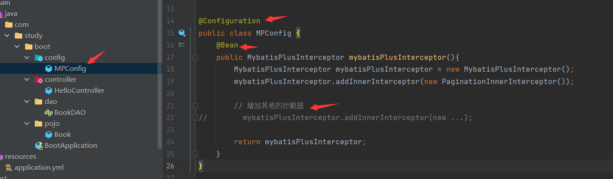
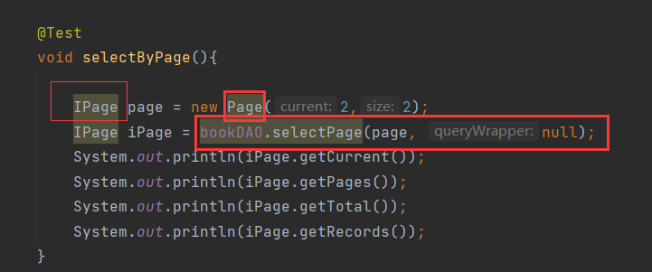
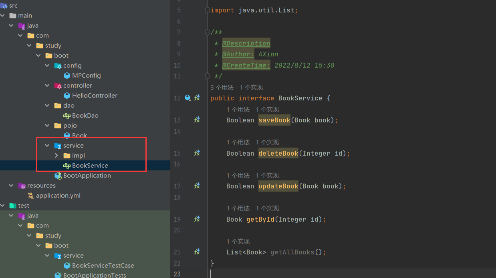
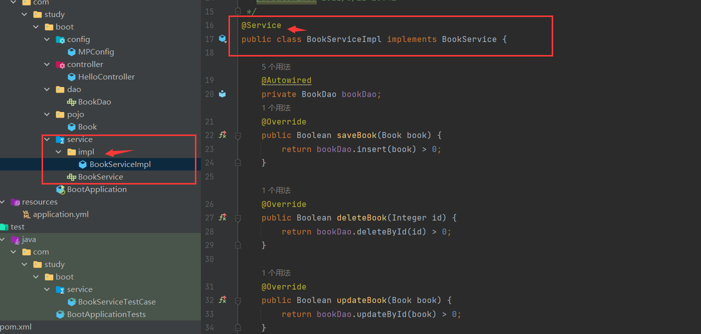
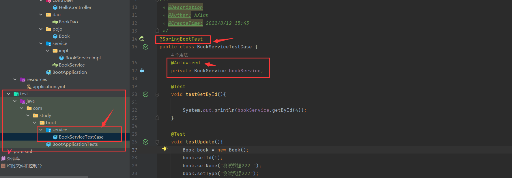
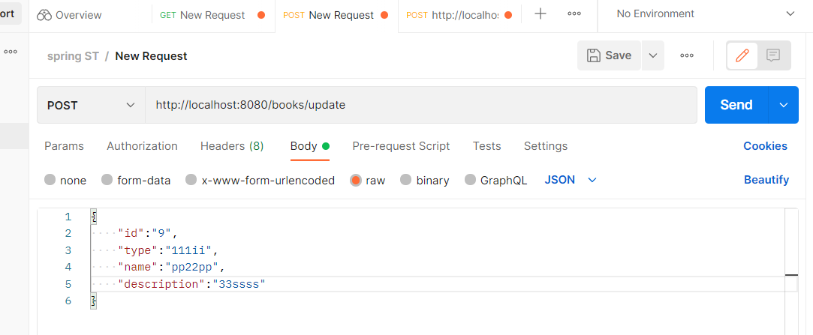
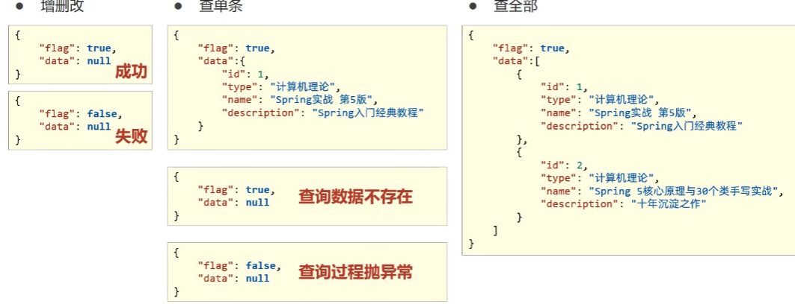

# 一、SpringBoot
## 1.1、Spring Boot入门

### 1.1.1、依赖：

- 开发SpringBoot成需要继承spring-boot-starter-parent
- spring-boot-starter-parent 中定义了若干个依赖管理
- 继承parent 模块可以避免多个依赖使用相同的技术时出现依赖版本冲突
- 继承parent 的形式可以采用引入以来的形式实现效果
- 导入依赖出现错误时，需要检查是否定义了依赖版本坐标，再次刷新即可

### 1.1.2、主启动类：

```java
public static void main(String[] args) {
        SpringApplication.run(BootApplication.class, args);
    }
```

```java
SpringApplication.run(BootApplication.class, args);
```

就是启动了一个容器，可以使用方法查看

```java
public static void main(String[] args) {
        ConfigurableApplicationContext ctx = SpringApplication.run(BootApplication.class, args);
        HelloController bean = ctx.getBean(HelloController.class);
        System.out.println(bean);
    }
```

可以得到相应的结果

- SpringBoot的引导类是Boot工程的执行入口，运行 main方法就可以启动项目
- SpringBoot 工程运行后初始化 Spring容器，扫描引导类所在包加载 bean


### 1.1.3、REST风格：

- 简介：
  - REST ： 表现形式状态转换
  - 

- 优点：
  - 隐藏资源访问行为，无法通过地址得知资源是如何操作
  - 书写简化

- 

- 根据 REST 风格对资源进行资源进行访问时使用的是 RESTful

注意： 上述行为是约定方式，约定不是规范，可以打破，所以称为REST风格，而不是REST规范


- RequestBody  @RequestParam   @PathVariable
- 区别：
  - @RequestBody 用于接收 json 数据
  - @RequestParam  用于接收url地址传参或表单传参
  - @PathVariable  用于接收路径参数，使用 {参数名称}描述路径参数
- 应用：
  - 后期开发中，发送请求参数超过一个时，以json格式为主， @RequestBody 应用较广
  - 如果发送为非 json 格式数据，选用 @RequestParam 接受请求参数
  - 采用 RESTful 进行开发时，当参数数量较少时（1个），使用 @PathVariable 接收请求路径变量，通常用于传递id值

### 1.1.4、RESTful 快速开发：

- 名称：@RestController
- 类型：类注解
- 位置：基于 SpringMVC 的 RESTful 开发控制器类定义上方
- 作用：设置当前控制器类为 RESTful 风格，等同于 @Controller 与 @ResponseBody 两个注解组个功能


## 1.2、基础配置

### 1.2.1、属性配置：

- 修改配置：

  - 修改端口：

    ```properties
    server.port=8080
    ```

    idea 默认配置文件为 application.properties ，修改方式为 键值对方式进行修改

    查询所有的配置文件 https://docs.spring.io/spring-boot/docs/current/reference/html/application-properties.html#appendix.application-properties


### 1.2.2、配置文件类型：

- application.properties:

- application.yaml  （与application.yml 一致）

  - yaml 格式(一种数据序列化格式)

  ```yaml
  server:
  	port: 8081
  	...: ...
  .....:
  	...: ...
  	...: ...
  ```

- 三个配置文件共存时（properties、yml、yaml）
  - 优先级： properties > yml > yaml

- 优点：
  - 容易阅读
  - 容易与脚本语言交互
  - 以数据为核心，重数据轻格式

- 语法规则：
  - 大小写敏感
  - 属性层级关系使用多行描述，每行结尾使用冒号结束
  - 使用缩进表示层级关系，同层级左侧对其，只允许使用空格（不允许使用tab键）
  - 属性值前面添加空格（属性名和属性值之间使用冒号 + 空格作为分隔）
  - 使用 @value 进行读取yaml中的数据
  
  ```java
  @value("${server.port}")
  private String port;
  
  @GetMapping
  public String getPort(){
      sout("prot==>" + port);
      return "is running";
  }
  ```

### 1.2.3、读取yaml文件中的变量引用：

```yaml
baseDir: c:\win10

#使用${属性名} 进行引用数据
tempDir: ${baseDir}\temp
```

```java
@value("${server.port}")
private String tempDir;

@GetMapping
public String getTempDir(){
    sout("tempDir==>" + tempDir);
    return "is running";
}

// 得到 tempDir==>c:\win10\temp
```

```yaml
#使用tempDir: "${baseDir}\temp"
#实现了 转义字符 \t
#输出 tempDir==>c:\win10 emp
```

- 在配置文件中可以使用属性名引用方式引用属性名   ${属性名}
- 属性值中如果出现转义字符，需要使用双引号进行包裹实现转义字符

### 1.2.4、读取全部数据（Environment）：

```java
@Autowired
private Environment env;
// 使用自动装配将所有的数据封装进一个对象Environment 中
//输出时
sout(env.getProperty("server.port"));
```

- 使用@ConfigurationProperties 注解绑定配置信息到封装类中
- 封装类需要定义为 Spring 管理的 bean ，否则无法进行属性注入

## 1.3、整合第三方技术

### 1.3.1、整合Junit：

- 名称：@SpringBootTest
- 类型：测试类注解
- 位置：测试类定义上方
- 作用：设置Junit加载的SpringBoot启动类

```java
@SpringBootTest
class BootApplicationTests {
    @Autowired
    private BookDao bookDao;

    @Test
    void contextLoads() {
        bookDao.save();
        System.out.println("running");
    }
}
```

步骤：

- 导入测试对应的starter
- 测试类使用@SpringBootTest 修饰
- 使用自动装配的形式添加要测试的对象


- 测试类如果存在于引导类所在包或者子包中无需指定引导类
- 测试类如果不存在于引导类所在的包或子包中需要通过classes属性指定引导类

```java
@SpringBootTest(classes = Springboot05JUnitApplication.class)
class SpringbootApplicationTests{}
```

### 1.3.2、整合Mybatis：

- 核心配置：数据库连接相关信息
- 映射配置：SQL映射（XML / 注解）

步骤：

- 创建新模块，选择spring 初始化，并配置模块相关基础信息
- 选择当前模块需要使用的技术集（MyBatis、MySQL）
- 设置数据源参数

```yaml
#配置相关信息
spring:
  datasource:
    driver-class-name: com.mysql.jdbc.Driver
    url: jdbc:mysql://localhost/ssm_db
    username: root
    password: 123456
```

- 定义数据层接口与映射配置

```java
@Mapper
public interface UserDao{
    @Select("select * from user")
    public List<User> getAll();
}
```

- 测试类中注入dao 接口，测试功能

```java
@SpringBootTest
class BootApplicationTests {
    @Autowired
    private BookDao bookDao;
    @Test
    void contextLoads() {
        System.out.println(bookDao.getAllBook());
    }
}
```

- 出现时区问题时在yaml文件中url 后增加 serverTimezone=UTC  (MySQL 8.X驱动强制要求设置时区)

```yaml
    url: jdbc:mysql://localhost/ssm_db?serverTimezone=UTC
```

- 驱动类过时，提醒更换为com.mysql.cj.jdbc.Driver

### 1.3.3、整合MyBatis-Plus：

- MyBatis-Plus 与 MyBatis 区别
  - 导入坐标不同
  - 数据层实现简化

步骤：

- 手动添加SpringBoot 整合Mybatis-Plus 的坐标，可以通过mvnrepository 获取

```xml
<!-- https://mvnrepository.com/artifact/com.baomidou/mybatis-plus-boot-starter -->
<dependency>
    <groupId>com.baomidou</groupId>
    <artifactId>mybatis-plus-boot-starter</artifactId>
    <version>3.4.3</version>
</dependency>
```

- 定义数据层接口与映射配置，继承 BaseMapper 

```java
@Mapper
public interface BookDao extends BaseMapper<Book> {
}
```


查看BaseMapper 中的方法

### 1.3.4、整合druid：

1、导入相关坐标

```xml
<dependency>
            <groupId>com.alibaba</groupId>
            <artifactId>druid-spring-boot-starter</artifactId>
            <version>1.2.11</version>
</dependency>
```

2、变更Druid 的配置方式

```yaml
spring:
  datasource:
    druid:
      driver-class-name: com.mysql.cj.jdbc.Driver
      url: jdbc:mysql://localhost/ssm_db?serverTimezone=UTC
      username: root
      password: 123456
      #    type: com.alibaba.druid.pool.DruidDataSource
```

整合任意第三方技术：

- 导入对应的starter
- 配置对应的设置或采用默认的配置

## 1.4、基于SpringBoot 整合SSMP 的整合案例：

步骤：

- 勾选SpringMVC 与 MySQL 的坐标
- 加入依赖 MyBatisPlus 、 Druid 、 lombok
- 修改配置文件为 yml
- 修改端口号  

```yaml
server:
	port： 8080
```

### 1.4.1、数据层开发：

使用Mybatis-Plus 时 需要注意 id生成策略修改为数据库自增策略

```yaml
server:
  port: 8080
spring:
  datasource:
    druid:
      driver-class-name: com.mysql.jdbc.Driver
      url: jdbc:mysql://localhost:3306/ssm_db?serverTimezone=UTC
      username: root
      password: 123456
mybatis-plus:
  global-config:
    db-config:
      table-prefix: tb1_
      id-type: auto
```

开启MyBatis-Plus 的日志调试

```yaml
  mybatis-plus:
    global-config:
      db-config:
        table-prefix: tb1_
        id-type: auto
    configuration:
      log-impl: org.apache.ibatis.logging.stdout.StdOutImpl
```


#### **分页查询：**

```java
@Test
    void pageSelect(){

        IPage page = new Page(1,5);
        bookDao.selectPage(page,null);
    }
```

注意：  想要使用分页查询时，就要配对相应的拦截器

分页操作依赖MyBatisPlus 分页拦截器实现功能

- 创建配置包 创建相应的拦截器
- 需要不同拦截器时直接在其中增加即可。
- 返回一个interceptor

```java
@Configuration
public class MPConfig {
    @Bean
    public MybatisPlusInterceptor mybatisPlusInterceptor(){
        //定义Mp 拦截器
        MybatisPlusInterceptor mybatisPlusInterceptor = new MybatisPlusInterceptor();
        // 添加具体的拦截器
        mybatisPlusInterceptor.addInnerInterceptor(new PaginationInnerInterceptor());

        // 增加其他的拦截器
//        mybatisPlusInterceptor.addInnerInterceptor(new ...);

        return mybatisPlusInterceptor;
    }
}
```



- 分页查询中page存储了诸多数据  可进行查看




#### **条件查询（querryWrapper(); ）：**

- bookQueryWrapper.select 中 name 为字段名  仙 为中间的内同内容

```java
@Test
    void selectByqw(){
        QueryWrapper<Book> bookQueryWrapper = new QueryWrapper<>();
        bookQueryWrapper.like("name","仙");
        
        System.out.println(bookDAO.selectList(bookQueryWrapper));
    }
```

****

**LambdaQueryWrapper：**

```java
 @Test
    void selectLamQW() {

        String name = "1";
        LambdaQueryWrapper<Book> lqw = new LambdaQueryWrapper<Book>();
            lqw.like(name != null,Book::getId, name);
            bookDAO.selectList(lqw);
        
        System.out.println(bookDAO.selectList(lqw));
    }
```

出现错误时，将 MyBatis—Plus 版本改为 3.4.2 即可

```java
org.mybatis.spring.MyBatisSystemException: nested exception is org.apache.ibatis.builder.BuilderException: Error evaluating expression 'ew.sqlSegment != null and ew.sqlSegment != '' and ew.nonEmptyOfWhere'. Cause: org.apache.ibatis.ognl.OgnlException: sqlSegment [java.lang.ExceptionInInitializerError]

```


### **1.4.2、业务层：**

- service

```java
public interface BookService {
    Boolean saveBook(Book book);

    Boolean deleteBook(Integer id);

    Boolean updateBook(Book book);

    Book getById(Integer id);

    List<Book> getAllBooks();
}
```



- serviceImpl

```java
@Service
public class BookServiceImpl implements BookService {

    @Autowired
    private BookDao bookDao;
    @Override
    public Boolean saveBook(Book book) {
        return bookDao.insert(book) > 0;
    }

    @Override
    public Boolean deleteBook(Integer id) {
        return bookDao.deleteById(id) > 0;
    }

    @Override
    public Boolean updateBook(Book book) {
        return bookDao.updateById(book) > 0;
    }

    @Override
    public Book getById(Integer id) {
        return bookDao.selectById(id);
    }

    @Override
    public List<Book> getAllBooks() {
        return bookDao.selectList(null);
    }
}
```



- 测试类 BookServiceTestCase

```java
@SpringBootTest
public class BookServiceTestCase {
    @Autowired
    private BookService bookService;

    @Test
    void testGetById(){

        System.out.println(bookService.getById(4));
    }

    @Test
    void testUpdate(){
        Book book = new Book();
        book.setId(1);
        book.setName("测试数据222 ");
        book.setType("测试数据222");
        book.setDescription("测试数据222");

        bookService.updateBook(book);
    }

    @Test
    void testSave(){
        Book book = new Book();
        book.setName("测试数据123");
        book.setType("测试数据123");
        book.setDescription("测试数据123");
        bookService.saveBook(book);
    }

    @Test
    void testDelete(){
        bookService.deleteBook(5);
    }
}
```



### 1.4.3、表现层（Controller）：

- Dao

```java
@Mapper
public interface BookDao extends BaseMapper<Book> {

}

```

- Service

```java
public interface BookService {
    Boolean saveBook(Book book);

    Boolean deleteBook(Integer id);

    Boolean updateBook(Book book);

    Book getById(Integer id);

    List<Book> getAllBooks();
}
```

- serviceImpl

```java
@Service
public class BookServiceImpl implements BookService {

    @Autowired
    private BookDao bookDao;
    @Override
    public Boolean saveBook(Book book) {
        return bookDao.insert(book) > 0;
    }

    @Override
    public Boolean deleteBook(Integer id) {
        return bookDao.deleteById(id) > 0;
    }

    @Override
    public Boolean updateBook(Book book) {
        return bookDao.updateById(book) > 0;
    }

    @Override
    public Book getById(Integer id) {
        return bookDao.selectById(id);
    }

    @Override
    public List<Book> getAllBooks() {
        return bookDao.selectList(null);
    }
}
```

- Controller

```java
@RestController
@RequestMapping("/books")
public class BookController {

    @Autowired
    private BookService bookService;

    @GetMapping("/getAllBooks")
    public List<Book> getAllBooks(){
       return bookService.getAllBooks();
    }

    @PostMapping("/insert")
    public boolean saveBook(@RequestBody Book book){
//        Book book = new Book();
//        book.setName("测试数据444");
//        book.setType("测试数据555");
//        book.setDescription("测试数据666");
        return bookService.saveBook(book);
    }


    @PostMapping("/update")
    public boolean updateBook(@RequestBody Book book){
//        Book book = new Book();
//        book.setId(id);
//        book.setName("ceshixi");
//        book.setType("1111");
//        book.setDescription("ooooo");
        return bookService.updateBook(book);
    }

    @PostMapping("/delete/{id}")
    public boolean deleteBookById(@PathVariable Integer id){
        return bookService.deleteBook(id);
    }

    @GetMapping("/select/{id}")
    public Book selectById(@PathVariable Integer id){
        return bookService.getById(id);
    }

}
```

使用postman 进行调用




英文状态下 




这样图片就能上传上来了  能够便于保存  如果直接复制进来会造成一个问题  当你的文件要移动的时候  图片可能会找不到    ./images/11.png 这个是图片路径  不进行手写的的话  


他会默认保存在C:\Users\yilon\Desktop\All\knowledge\上传知识点git\springboot.assets\image-20220815131334348.png


我将文件上传一下可以看一下   最常用的是github


