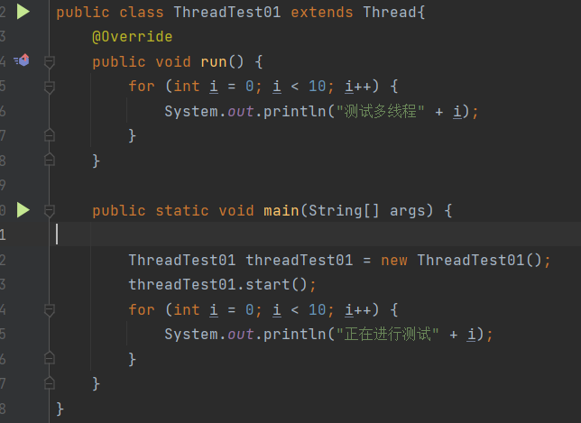
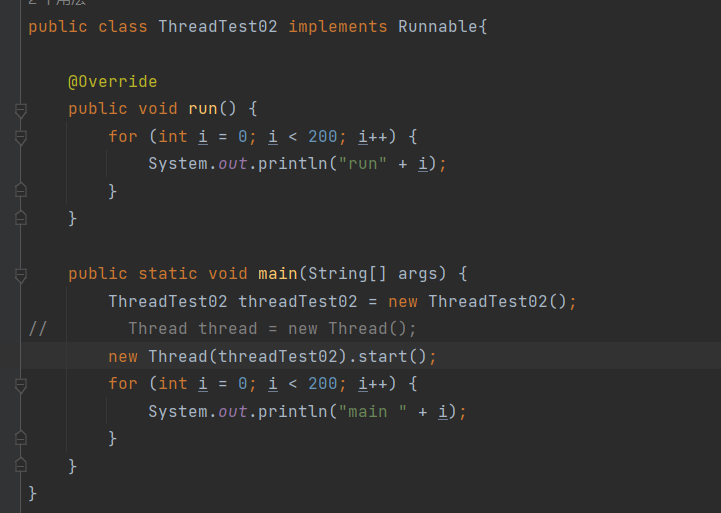
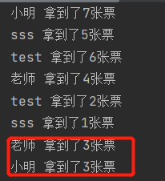
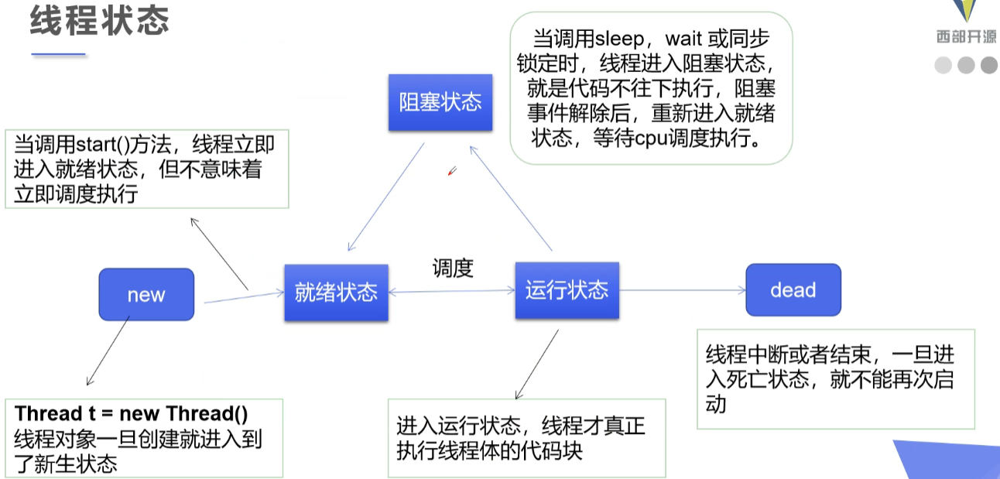
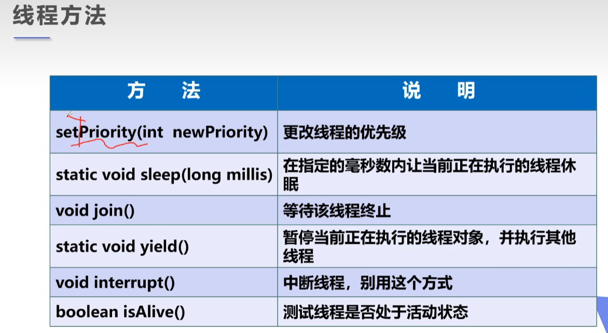
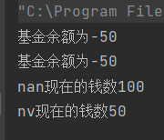

# 重点：、

- 线程就是独立的执行路径
- 在程序运行时，即使没有自己创建线程，后台也会有多个线程，如 主线程、gc线程
- main() 称之为主线程，为系统的入口，用于执行整个程序
- 在一个进程中，如果开辟了多个线程，线程的运行由调度器安排调度，调度器是与操作系统紧密相关的，先后顺序是不能人为的干预的
- 对同一份资源操作时，会存在资源抢夺的问题，需要加入并发控制
- 线程会带来额外的开销，如cpu调度时间、并发控制开销
- 线程每个线程在自己的工作内存交互，内存控制不当会造成数据不一致

# 一、多线程的启动的方式：

- 继承Thread类：
  - 启动线程： 子线程.start();
  - 不建议使用：避免OOP单继承的局限性



示例：

```java
public class ThreadTest01Impl extends Thread{

    private String url;
    private String name;

    public ThreadTest01Impl(String url,String name){
        this.url = url;
        this.name = name;
    }
    @Override
    public void run() {
        WebDownloader webDownloader = new WebDownloader();
        webDownloader.webDownload(url,name);
        System.out.println("下载了文件" + name);

    }

    public static void main(String[] args) {
        ThreadTest01Impl threadTest01 = new ThreadTest01Impl("https://img2.nongji360.com/n/news/2020/06/17092829650213.jpg", "1.jpg");
        ThreadTest01Impl threadTest02 = new ThreadTest01Impl("https://img2.nongji360.com/n/news/2020/06/17092829650213.jpg", "2.jpg");
        ThreadTest01Impl threadTest03 = new ThreadTest01Impl("https://img2.nongji360.com/n/news/2020/06/17092829650213.jpg", "3.jpg");

        threadTest01.start();
        threadTest02.start();
        threadTest03.start();
    }
}

class WebDownloader{
    public void webDownload(String url,String name){
        try {
            FileUtils.copyURLToFile(new URL(url),new File(name));
        } catch (IOException e) {
            e.printStackTrace();
            System.out.println("IO异常，WebDownloader异常");
        }
    }
}
```


- 实现Runnable 接口：
  - 实现Runnable 接口具有多线程能力
  - 启动线程：传入目标对象 + Thread对象.start
  - 推荐使用： 避免单继承的局限性，灵活方便，方便一个对线被多个线程使用



示例：

```java
public class ThreadTest02Impl implements Runnable{
    private String name;
    private String url;

    public ThreadTest02Impl(String url,String name){
        this.name = name;
        this.url = url;
    }

    @Override
    public void run() {
        WebDownLoader1 webDownLoader1 = new WebDownLoader1();
        webDownLoader1.webDownload(url,name);
        System.out.println("下载了" + name);
    }

    public static void main(String[] args) {
        ThreadTest02Impl threadTest01 = new ThreadTest02Impl("https://img2.nongji360.com/n/news/2020/06/17092829650213.jpg", "1.jpg");
        ThreadTest02Impl threadTest02 = new ThreadTest02Impl("https://img2.nongji360.com/n/news/2020/06/17092829650213.jpg", "2.jpg");
        ThreadTest02Impl threadTest03 = new ThreadTest02Impl("https://img2.nongji360.com/n/news/2020/06/17092829650213.jpg", "3.jpg");
        new Thread(threadTest01).start();
        new Thread(threadTest02).start();
        new Thread(threadTest03).start();

    }
}

class WebDownLoader1{
    public void webDownload(String url,String name){
        try {
            FileUtils.copyURLToFile(new URL(url),new File(name));
        } catch (IOException e) {
            e.printStackTrace();
            System.out.println("方法异常，ThreadTest02Impl");
        }
    }
}
```

# 二、出现并发问题：

```java
/**
 * 并发问题
 */
public class ThreadTest03 implements Runnable{
    private int ticketNum = 10;
    @Override
    public void run() {
        while (true){
            if (ticketNum <= 00){
                break;
            }
            // 模拟延时
            try {
                Thread.sleep(200);
            } catch (InterruptedException e) {
                e.printStackTrace();
            }
            System.out.println(Thread.currentThread().getName() + " 拿到了" + ticketNum-- + "张票");
        }
    }
    public static void main(String[] args) {
        ThreadTest03 threadTest03 = new ThreadTest03();
        new Thread(threadTest03,"小明").start();
        new Thread(threadTest03,"老师").start();
        new Thread(threadTest03,"test").start();
        new Thread(threadTest03,"sss").start();
    }
}

```



对同一对象进行重复操作

- 龟兔赛跑问题：

```java
public class Race implements Runnable{
    private static String winner;
    @Override
    public void run() {
        for (int i = 0; i < 101; i++) {
            // 判断比赛是否结束
            boolean flag = getWinner(i);
            if (flag){
                break;
            }
            if (Thread.currentThread().getName().equals("兔子") && i % 10 == 0){
                try {
                    Thread.sleep(1);
                } catch (InterruptedException e) {
                    e.printStackTrace();
                }
            }

            System.out.println(Thread.currentThread().getName() + "--> 跑了" +
                    i + "步");
        }
    }

    private boolean getWinner(int step){
        if (winner != null){
            return true;
        }
        {
            if (step >= 100) {
                winner = Thread.currentThread().getName();
                System.out.println("winner is" + winner);
                return true;
            } else {
                return false;
            }
        }
    }

    public static void main(String[] args) {
        Race race = new Race();
        new Thread(race,"兔子").start();
        new Thread(race,"乌龟").start();
    }
}

```

# 三、实现Callable 接口（了解即可）：

**好处：	**

- 可以定义返回值
- 可以跑出异常

步骤：

- 实现Callable接口，需要返回值类型
- 重写call 方法  ，抛出异常
- 创建目标对象
- 创建执行服务：ExecutorService ser = Executors.newFixedThreadPool(3);
- 提交执行：Future<Boolean> r1 = ser.submit(callAbleTest01);
- 获取结果：boolean rs1 = r1.get();
- 关闭服务：ser.shutdown();

```java
```

```java
/**
 * 实现callable接口
 */
public class CallAbleTest01 implements Callable<Boolean> {

    private String url;
    private String name;

    public CallAbleTest01(String url,String name){
        this.name = name;
        this.url = url;
    }
    @Override
    public Boolean call() throws Exception {

        WebDownloaderCallable webDownloaderCallable = new WebDownloaderCallable();
        webDownloaderCallable.WebDownload(url,name);
        System.out.println("call下载文件" + name);
        return true;
    }

    public static void main(String[] args) throws ExecutionException, InterruptedException {
        CallAbleTest01 callAbleTest01 = new CallAbleTest01("https://img2.nongji360.com/n/news/2020/06/17092829650213.jpg", "1.jpg");
        CallAbleTest01 callAbleTest02 = new CallAbleTest01("https://img2.nongji360.com/n/news/2020/06/17092829650213.jpg", "2.jpg");
        CallAbleTest01 callAbleTest03 = new CallAbleTest01("https://img2.nongji360.com/n/news/2020/06/17092829650213.jpg", "3.jpg");
        // 创建执行服务
        ExecutorService ser = Executors.newFixedThreadPool(3);

        // 提交执行结果
        Future<Boolean> r1 = ser.submit(callAbleTest01);
        Future<Boolean> r2 = ser.submit(callAbleTest02);
        Future<Boolean> r3 = ser.submit(callAbleTest03);
        // 获取结果
            boolean rs1 = r1.get();
            boolean rs2 = r2.get();
            boolean rs3 = r3.get();

            // 关闭服务
        ser.shutdown();
    }
}

// 文件下载类
class WebDownloaderCallable{
    public void WebDownload(String url,String name){
        try {
            FileUtils.copyURLToFile(new URL(url),new File(name));
        } catch (IOException e) {
            e.printStackTrace();
            System.out.println("出现异常情况" + "WebDownloadCallable");
        }
    }
}
```

# 四、静态代理:

模拟静态代理：

```java
import java.util.Scanner;

/**
 * 模拟静态代理
 */
public class StaticProxy {
    public static void main(String[] args) {
        
        // 传入的为代理的人
        MerryCompany merryCompany = new MerryCompany(new Person());
        Scanner scanner = new Scanner(System.in);
        String name = scanner.next();
        merryCompany.happyMarry(name);
    }
}

interface HappyMerry{
    void happyMarry(String name);
}
// Person 类  结婚的人
class Person implements HappyMerry{

    @Override
    public void happyMarry(String name) {
        System.out.println(name + "要结婚了");
    }
}

// 婚庆公司类  帮助结婚
class MerryCompany implements HappyMerry {

    private HappyMerry merry;
    // 构造器   
    public MerryCompany(HappyMerry merry){
        this.merry = merry;
    }
    @Override
    public void happyMarry(String name) {
        this.merryBefore();
        this.merry.happyMarry(name);
        this.merryAfter();
    }

    public void merryBefore(){
        System.out.println("结婚之前布置场地");
    }

    public void merryAfter(){
        System.out.println("结婚之后收钱");
    }
}

```

# 五、线程的五大状态：

- 创建状态：启动线程
- 就绪状态：线程启动之后或阻塞结束、释放CPU资源
- 阻塞状态：运行状态后等待用户输入等、
- 运行状态：获得CPU资源
- 死亡状态：线程自然执行完成、外部干涉终止



## 线程的方法：



###  1、停止线程：

- 建议使线程正常停止，-------利用循环进行，不要使用死循环
- 建议使用标志位   ----- 设置一个标志位进行线程停止
- 不要使用Stop   或者destory 或jdk官方不建议使用的方法进行停止线程

使用标志位进行停止线程

```java
public class TestStop implements Runnable{
    private boolean flag = true;
    @Override
    public void run() {
        int i = 0;
        while (flag){
            System.out.println("多线程正在进行。。。。。" + i++);
        }
    }

    // 线程标志位转换
    public void stop(){
        this.flag = false;
    }

    public static void main(String[] args) {
        TestStop testStop = new TestStop();
        new Thread(testStop).start();
        for (int i = 0; i < 1000; i++) {
            System.out.println("main 运行" + i);
            if (i == 900){
                // 进行线程标志位转换
                testStop.stop();
                System.out.println("线程测试停止");
            }
        }
    }
}
```

### 2、线程休眠（sleep）

- sleep(时间)  指定当前线程休眠的时间
- sleep 存在异常 InterreputedException
- sleep 时间达到后线程进入就绪状态
- sleep 模拟网络延时，倒计时等
- 每一个对象都有一个锁，sleep 不会释放锁

测试延时

```java
public class ThreadTest03 implements Runnable{
    private int ticketNum = 10;
    @Override
    public void run() {
        while (true){
            if (ticketNum <= 00){
                break;
            }
            // 模拟延时   存在线程不安全的情况   方法问题的发生性
            try {
                Thread.sleep(200);
            } catch (InterruptedException e) {
                e.printStackTrace();
            }
            System.out.println(Thread.currentThread().getName() + " 拿到了" + ticketNum-- + "张票");
        }
    }
    public static void main(String[] args) {
        ThreadTest03 threadTest03 = new ThreadTest03();
        new Thread(threadTest03,"小明").start();
        new Thread(threadTest03,"老师").start();
        new Thread(threadTest03,"test").start();
        new Thread(threadTest03,"sss").start();
    }
}
```

测试倒计时

```java
// 模拟倒计时
public class TestSleep02 {
    public static void main(String[] args) {
        try {
            time();
        } catch (InterruptedException e) {
            throw new RuntimeException(e);
        }
    }
    public static void time() throws InterruptedException {
        int num = 10;
        while (true){
            // 进行线程休眠模拟倒计时
            Thread.sleep(1000);
            System.out.println(num--);
            if (num <= 0)break;
        }
    }
}
```

### 3、线程礼让（yield）

- 让当前执行的线程暂停，但是不会阻塞
- 让线程从运行状态转换为就绪状态
- 让cpu 重新调度，礼让不一定成功，看 CPU 调度进行

```java
// 礼让不一定成功
    // 测试礼让
public class TestYield {
    public static void main(String[] args) {
        MyYield myYield = new MyYield();
        new Thread(myYield,"a").start();
        new Thread(myYield,"b").start();
    }
}
class MyYield implements Runnable{

    @Override
    public void run() {
        System.out.println(Thread.currentThread().getName() + "线程开始执行。。");
        Thread.yield();
        System.out.println(Thread.currentThread().getName() + "线程执行结束。。");
    }
}
```

### 4、线程的强制执行（join）：

- join 合并线程，待此线程执行完成之后，再执行其他线程，其余线程进入阻塞状态
- 可以想象为插队

```java
// 测试join
public class TestJoin implements Runnable{
    @Override
    public void run() {
        try {
            Thread.sleep(1000);   // 添加线程休眠凸显join作用
        } catch (InterruptedException e) {
            throw new RuntimeException(e);
        }
        for (int i = 0; i < 100; i++) {
            System.out.println(" run" + i);
        }
    }
// 主线程
    public static void main(String[] args) throws InterruptedException {
        TestJoin testJoin = new TestJoin();
        Thread thread = new Thread(testJoin);
        thread.start();


        for (int i = 0; i < 200; i++) {
            if (i == 100){
                thread.join();
            }
            System.out.println(" main " + i);
        }
    }
}
```

#### **注意：**

- 线程中断或者结束，即线程进入死亡状态，不能够重新启动

### 5、线程优先级：

- Java 提供一个线程调度器来监控程序中启动后进入就绪状态的所有线程 ，线程调度器按照线程的优先级决定优先调度哪个线程
- 线程的优先级使用数字表示，范围 1~10
  - Thread.MIN_PRIORITY = 1;
  - Thread.MAX_PRIORITY = 10;
  - Thread.NORM_PRIORITY = 5;
- 使用一下方式改变或获取优先级
  - getPriority().setPriority(int xxx);

```java
// 测试线程的优先级
public class TestPriority {
    public static void main(String[] args) {
        // 主线程的默认优先级
        System.out.println(Thread.currentThread().getName() + " -----> " + Thread.currentThread().getPriority());
        MyPriority myPriority = new MyPriority();
        Thread t1 = new Thread(myPriority);
        Thread t2 = new Thread(myPriority);
        Thread t3 = new Thread(myPriority);
        Thread t4 = new Thread(myPriority);
        Thread t5 = new Thread(myPriority);
        Thread t6 = new Thread(myPriority);

        t1.setPriority(1);
        t2.setPriority(4);
        t3.setPriority(Thread.MAX_PRIORITY); // MAX_PRIORITY = 10;
        t4.setPriority(6);
        t5.setPriority(Thread.NORM_PRIORITY); // NORM_PRIORITY = 5;
        t6.setPriority(2);
        
        t1.start();
        t2.start();
        t3.start();
        t4.start();
        t5.start();
        t6.start();

    }
}

class MyPriority implements Runnable{
    @Override
    public void run() {
        try {
            Thread.sleep(100);
        } catch (InterruptedException e) {
            throw new RuntimeException(e);
        }
        System.out.println(Thread.currentThread().getName() + " ----> " + Thread.currentThread().getPriority());
    }
}
```

#### **注意：**

- 高优先级的线程比低优先级的线程有更高的几率得到执行，实际上这和操作系统及虚拟机版本相关，有可能即使设置了线程的优先级也不会产生任何作用。
- 调度的顺序由CPU决定

### 6、守护线程（daemon）

- 线程分为用户线程和守护线程
- 虚拟机必须确保用户线程执行完毕
- 虚拟机不必等待守护线程执行完毕
- 如后台记录操作日志、垃圾回收等等

```java
// 测试守护线程
public class TestDaemon {
    public static void main(String[] args) {
        God god = new God();
        YourSelf yourSelf = new YourSelf();
        Thread thread = new Thread(god);
        thread.setDaemon(true);   //   默认为false   即默认为用户线程
        thread.start();

        new Thread(yourSelf).start();
    }
}

class YourSelf implements Runnable{

    @Override
    public void run() {
        for (int i = 0; i < 36500; i++) {
            System.out.println("正常的生活=====" + i);
        }
    }
}

class God implements Runnable{

    @Override
    public void run() {
        while (true){
            System.out.println("正在为你加油");
        }
    }
}
```

### **7、线程同步：**

- 同一个资源，多个人都想使用
- 处理多线程同步问题时，多个线程访问同一个对象，并且某些线程还想修改这个对象，这时候就需要线程同步
- 线程同步是一种等待机制，多个需要同时访问此对象的线程进入这个**对象的等待池** 形成队列，等待前面线程使用完毕，下一个线程再使用。

- 形成条件：队列和锁 解决线程安全性，即线程同步 synchronized


- 由于同一个进程的多个线程共享同一块存储空间，在带来的方便的同时也带来了访问冲突的问题，为了保证数据在方法中被访问时的正确性，在访问过程中添加锁机制 **synchronized** ，当一个线程获取对象的排他锁，独占资源，其他线程必须等待，然后释放锁之后即可，存在以下问题：
  - 一个线程持有锁会导致其他所有需要此锁的线程挂起
  - 在多线程竞争下，加锁、释放锁会导致较多的上下文切换和调度延时，引起性能问题
  - 如果一个优先级高的线程等待一个优先级低的线程释放锁，会导致优先级倒置，引起性能问题

异常示例：

```java
//模拟银行取款
public class Syn {
    public static void main(String[] args) {
        Account account = new Account(100, "基金");

        Drawing nv = new Drawing(account, 50, "nv");
        Drawing nan = new Drawing(account, 100, "nan");

        nv.start();
        nan.start();

    }

}

// 账户余额信息
class Account{
    int money;  // 账户余额
    String name;// 账户名称
    public Account(int money,String name){
        this.name = name;
        this.money = money;
    }
}

//银行取款
class Drawing extends Thread{
    // 账户
    Account account;
    // 取钱数
    int drawingMoney;
    // 你手里的💴
    int nowMoney;
    public Drawing(Account account, int drawingMoney, String name) {
        super(name);
        this.account = account;
        this.drawingMoney = drawingMoney;
//        this.nowMoney = nowMoney;
//        this.name = name;

    }

    @Autowired
    public void run(){    
            // 判断有没有💴
            if (account.money - drawingMoney < 0){
                System.out.println(Thread.currentThread().getName() + "钱不够");
                return;
            }
            account.money = account.money - drawingMoney;   // 卡内余额
            nowMoney = nowMoney + drawingMoney;  //你手里的💴
            System.out.println(account.name + "余额为" + account.money);
            System.out.println(this.getName() + "现在的钱数" + nowMoney);
    }
}
```



#### 同步方法：

- 由于可以通过 private 关键字来保证数据对象只能被方法访问，所以我们只需要针对方法提出一套机制，这套机制就是 syncronized 关键字，包括两种用法 ：  synchronized 方法 和 synchronized 块

​					同步方法： public synchronized void method(int args){}

- synchronized 方法控制对 “ 对象” 的访问，每一个对象对应一把锁，每个 synchronized 方法都必须获得调用该方法的对象的锁才能执行，否则线程会阻塞，方法一旦执行，就独占该锁，知道该方法返回才释放锁，后面被阻塞的线程才能获得这个锁，继续执行

​					缺陷： 若将一个大的方法申明为 synchronized 将会影响效率

####  同步块： synchronized(Obj){	}

- Obj 称之为同步监视器
  - Obj 可以为任何对象，但是推荐使用共享资源作为同步监视器
  - 同步方法中无需指定同步监视器，因为同步方法的同步监视器就是this，就是这个对象本身，或者是 class
- 同步监视器的执行过程：
  - 1、第一个线程访问，锁定同步监视器，执行其中的代码
  - 2、第二个线程访问，发现同步监视器被锁定，无法访问
  - 3、第一个线程访问完毕，解锁同步监视器
  - 4、第二个线程访问，发现同步监视器没有锁，然后锁定并访问

```java
//模拟银行取款
public class Syn {
    public static void main(String[] args) {
        Account account = new Account(100, "基金");
        Drawing nv = new Drawing(account, 50, "nv");
        Drawing nan = new Drawing(account, 100, "nan");

        nv.start();
        nan.start();

    }
}
// 账户余额信息
class Account{
    int money;  // 账户余额
    String name;// 账户名称
    public Account(int money,String name){
        this.name = name;
        this.money = money;
    }
}
//银行取款
class Drawing extends Thread{
    Account account;  // 账户
    int drawingMoney;  // 取钱数
    int nowMoney; // 你手里的💴
    public Drawing(Account account, int drawingMoney, String name) {
        super(name);
        this.account = account;
        this.drawingMoney = drawingMoney;
//        this.nowMoney = nowMoney;
//        this.name = name;
    }

    @Autowired
    public void run(){
        //添加同步块
        synchronized (account){
            // 判断有没有💴
            if (account.money - drawingMoney < 0){
                System.out.println(Thread.currentThread().getName() + "钱不够");
                return;
            }
            account.money = account.money - drawingMoney;   // 卡内余额
            nowMoney = nowMoney + drawingMoney;  //你手里的💴
            System.out.println(account.name + "余额为" + account.money);
            System.out.println(this.getName() + "现在的钱数" + nowMoney);
        }

    }
}
```

# 六、死锁：

- 多个线程各自占有一些些共享资源，并且互相等待其他线程占有的资源才能运行，而导致两个或者多个线程都在等待对方释放资源，都停止执行的情形。某一个同步块同事拥有 “ 两个以上对象的锁 ” 时，就可能会发生 “死锁”的问题。

模拟死锁：

```java
// 模拟死锁
public class DeadLock {
    public static void main(String[] args) {

        MakeUp g1 = new MakeUp(0, "g1");
        MakeUp g2 = new MakeUp(1, "g2");
        g1.start();
        g2.start();
    }
}
// 镜子
class Mirror{}
// 口红
class Lipstick{}

// 化妆
class MakeUp extends Thread{
    static  Mirror mirror  = new Mirror();
    static Lipstick lipstick = new Lipstick();   // 确保资源只有一份，使用static 来进行修饰

    int choice;  // 选择
    String name;  // 使用者
    MakeUp(int choice,String name){
        this.choice = choice;
        this.name = name;
    }
    @Override
    public void run() {
        try {
            makeUp();
        } catch (InterruptedException e) {
            throw new RuntimeException(e);
        }
    }
    private void makeUp() throws InterruptedException {
        if (choice == 0){
            synchronized (mirror){
                System.out.println(this.name + " 获得了镜子锁");
                Thread.sleep(1000);
                synchronized (lipstick){
                    System.out.println(this.name + "获得了口红锁");
                }
            }
        }else {
            synchronized (lipstick){
                System.out.println(this.name + " 获得了口红锁");
                Thread.sleep(2000);
                synchronized (mirror){
                    System.out.println(this.name + "获得了镜子锁");
                }
            }
        }
    }
}
```

#### 死锁的条件：

- 1、互斥条件：每个资源每次只能被一个进程使用
- 2、请求与保持条件：一个进程因请求资源而阻塞时，对以获得的资源保持不放
- 3、不剥夺条件：进程已获得的资源，在未使用完之前，不能强行剥夺
- 4、循环等待条件：若干进程之间形成一种头尾相接的循环等待资源关系

只需要想办法破除其中任意一个或多个条件就可以避免死锁发生

解决办法：

```java
private void makeUp() throws InterruptedException {
        if (choice == 0){
            synchronized (mirror){
                System.out.println(this.name + " 获得了镜子锁");
                Thread.sleep(1000);
            }
            synchronized (lipstick){
                System.out.println(this.name + "获得了口红锁");
            }
        }else {
            synchronized (lipstick){
                System.out.println(this.name + " 获得了口红锁");
                Thread.sleep(2000);
            }
            synchronized (mirror){
                System.out.println(this.name + "获得了镜子锁");
            }
        }
    }
```

# 七、锁：

- 从JDK 5.0 开始，java提供了更强大的线程同步机制——通过显式定义同步锁对象实现同步。同步锁使用Lock对象充当
- java.util.concurrent.locks.Lock 接口时控制多个线程对共享资源进行访问的工具，所提供了对共享资源的独占访问，每次只能由一个线程对Lock对象加锁，线程开始访问共享资源之前应先获得Lock对象
- ReentrantLock 类实现了Lock ，它拥有与 synchronized 相同的并发性和内存语义，在实现线程安全的控制中，比较常用的时ReentrantLock，可以显式加锁、释放锁。

## ReentrantLock （可重入锁）：

```java
public class LockTest01 {
    public static void main(String[] args) {
        TicketNum ticketNum = new TicketNum();
        new Thread(ticketNum).start();
        new Thread(ticketNum).start();
        new Thread(ticketNum).start();
    }
}
class TicketNum implements Runnable{
    int ticketNums = 10;

    //定义lock锁
    private final ReentrantLock reentrantLock = new ReentrantLock();

    @Override
    public void run() {
        while (true){
            try {
                // 加锁
                reentrantLock.lock();
                if (ticketNums > 0){

                    System.out.println(ticketNums--);
                }else {
                    break;
                }
            }finally {
                //解锁
                reentrantLock.unlock();
                try {
                    Thread.sleep(1000);
                } catch (InterruptedException e) {
                    throw new RuntimeException(e);
                }
            }

        }
    }
}
```

# 八、synchronized 与 Lock 的对比：

- Lock 是显式锁（手动开启和关闭锁，别忘记关锁） synchronized 是隐式锁，除了作用域自动释放
- Lock只有代码块锁，synchronized 有代码块锁和方法锁
- 使用Lock锁，JVM将花费较少的时间来调度线程，性能更好，并且具有更好的扩展性（提供更多子类）
- 使用优先顺序：
  - Lock > 同步代码块（已经进入方法体，分配了相应资源） > 同步方法（在方法体之外）

# 九、线程协同：

- 线程通信：是一个线程同步问题，生产者和消费者共享同一个资源，并且生产者和消费者之间相互依赖，互为条件。
  - 在生产者消费者问题中，仅有synchronized 是不够的
    - synchronized 可阻止并发更新同一个共享资源，实现了同步
    - synchronized 不能用来实现不同线程之间的消息传递（通信）


- 解决线程之间的通信问题：
  - wait() ： 表示线程一直等待，直到其他线程通知，与sleep 不同，会释放锁
  - wait(long timeout) ： 指定等待的毫秒数
  - notify() ： 唤醒一个处于等待状态的线程
  - notifyAll() ： 唤醒同一个对象上所有调用wait() 方法的线程，优先级别高的线程优先调度
- **注意：** 均是Object类的方法，都只能在同步方法或者同步代码块中使用，否则会抛出异常IIIegaImonitorStateExcrption

# 十、线程池：

- 背景：经常创建和销毁、使用量特别大的资源，比如并发情况下的线程，对性能影响很大
- 思路：提前创建好多个线程，放入线程池中，使用时直接获取，使用完放回池中可以避免频繁的创建销毁、实现重复利用。
- 好处：
  - 提高响应速度（减少了创建新线程的时间）
  - 降低资源消耗（重复利用线程池中线程，不需要每次都创建）
  - 便于线程管理
    - corePoolSize ： 核心池的大小
    - maximumPoolSize ： 最大线程数
    - keepAliveTime ： 线程没有任务时最多保持多长时间后会终止
- JDK 5.0 起提供了线程池相关API ： ExecutorService 和 Executors
- ExecutorService ： 真正的线程池接口。常见子类 ThreadPoolExecutor
  - void execute(Runnable command) : 执行任务/命令，没有返回值，一般用来执行Runnable
  - <T> Future<T> submit(Callable<T> task) ：执行任务，有返回值，一般用来执行Callable
  - void shutdown() ：关闭连接池
- Executors ： 工具类、线程池的工厂类，用于创建并返回不同类型的线程池
